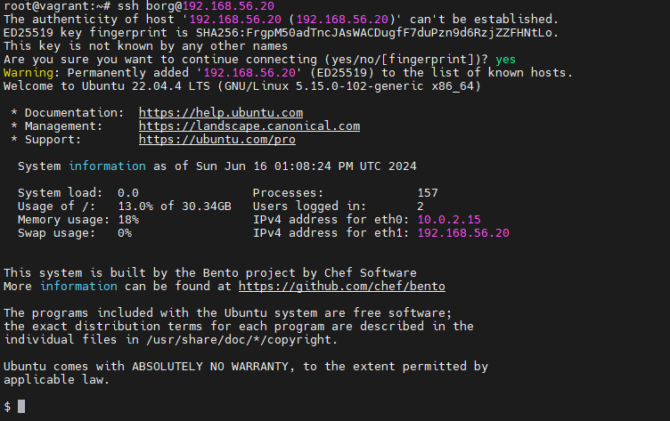

# Backup_Borg
Резервное копирование 
1. ``` Vagrant up ``` поднимает 2 машины  **backup_server и client**
2. устанавливаем Borg на 2-х машинах.
3. на сервере создаем пользователя **borg**
```
root@vagrant:~# sudo -i -u borg
$ mkdir .ssh
$ touch .ssh/authorized_keys
```
4. Далее на коиенте генерируем ключи
```
 root@vagrant:~# ssh-keygen
Generating public/private rsa key pair.
Enter file in which to save the key (/root/.ssh/id_rsa):
Enter passphrase (empty for no passphrase):
Enter same passphrase again:
Your identification has been saved in /root/.ssh/id_rsa
Your public key has been saved in /root/.ssh/id_rsa.pub
The key fingerprint is:
SHA256:h9NNZEqoK6w14iFlTiZN+JLgF82J0Wff8+TRd0FI4C8 root@vagrant
The key's randomart image is:
+---[RSA 3072]----+
| . .* .  ...=.o. |
|o .o = o...+ . . |
|o=  . o.. o.. . .|
|+.B.  .  + =.o .o|
| O..   .S oE*.. o|
|. + = .  o  .o   |
| o = o           |
|  o              |
|                 |
+----[SHA256]-----+
```
5.  копируем наш ключ ``` cat /root/.ssh/id_rsa.pub ```  и вставляем его на сервере в ``` .ssh/authorized_keys ```
6. с клиента проверяем подключение ``` ssh borg@192.168.56.20 ```
7. 
8.  На сервере:
```
root@vagrant:~# mkdir /var/backup
root@vagrant:~# chown borg:borg /var/backup/
root@vagrant:~# chmod 700 .ssh
root@vagrant:~# chmod 600 .ssh/authorized_keys
```
9. Все дальнейшие действия будут проходить на client сервере. Инициализируем репозиторий borg на backup сервере с client сервера
10. Запускаем для проверки создание бэкапа
```
root@vagrant:~# borg create --stats --list borg@192.168.56.20:/var/backup/::"etc-{now:%Y-%m-%d_%H:%M:%S}" /etc
Enter passphrase for key ssh://borg@192.168.56.20/var/backup:
s /etc/mtab
s /etc/os-release
s /etc/resolv.conf
s /etc/rmt
s /etc/vtrgb
d /etc/ModemManager/connection.d
d /etc/ModemManager/fcc-unlock.d
d /etc/ModemManager
```
11. 
12. смотрим что получилось
```
root@vagrant:~# borg list borg@192.168.56.20:/var/backup/
Enter passphrase for key ssh://borg@192.168.56.20/var/backup:
etc-2024-06-16_13:24:50              Sun, 2024-06-16 13:24:57 [de08af46c6015da24e93545aa870a10ec6486aa2ec5d1748a46002de869080d2]
```
13.  смотрим список файлов
```
root@vagrant:~# borg list borg@192.168.56.20:/var/backup/::etc-2024-06-16_13:24:50
Enter passphrase for key ssh://borg@192.168.56.20/var/backup:
drwxr-xr-x root   root          0 Sun, 2024-06-16 12:42:59 etc
lrwxrwxrwx root   root         19 Fri, 2024-02-16 18:44:26 etc/mtab -> ../proc/self/mounts
lrwxrwxrwx root   root         21 Wed, 2024-02-14 14:47:50 etc/os-release -> ../usr/lib/os-release
lrwxrwxrwx root   root         39 Fri, 2024-02-16 18:44:25 etc/resolv.conf -> ../run/systemd/resolve/stub-resolv.conf
lrwxrwxrwx root   root         13 Tue, 2023-12-05 05:15:51 etc/rmt -> /usr/sbin/rmt
lrwxrwxrwx root   root         23 Fri, 2024-02-16 18:46:20 etc/vtrgb -> /etc/alternatives/vtrgb
drwxr-xr-x root   root          0 Fri, 2024-02-16 18:51:28 etc/ModemManager
drwxr-xr-x root   root          0 Wed, 2023-12-20 05:35:16 etc/ModemManager/connection.d
drwxr-xr-x root   root          0 Wed, 2023-12-20 05:35:16 etc/ModemManager/fcc-unlock.d
drwxr-xr-x root   root          0 Fri, 2024-02-16 18:50:11 etc/PackageKit
-rw-r--r-- root   root        706 Thu, 2022-02-17 13:13:28 etc/PackageKit/PackageKit.conf
-rw-r--r-- root   root       1718 Mon, 2022-03-14 19:11:19 etc/PackageKit/Vendor.conf
drwxr-xr-x root   root          0 Fri, 2024-02-16 18:44:58 etc/X11
drwxr-xr-x root   root          0 Fri, 2024-02-16 18:48:39 etc/X11/Xsession.d
-rw-r--r-- root   root       1062 Mon, 2021-06-28 12:15:25 etc/X11/Xsession.d/20dbus_xdg-runtime
...
```
14. Автоматизируем создание бэкапов с помощью systemd  Создаем сервис и таймер в каталоге /etc/systemd/system/

 

